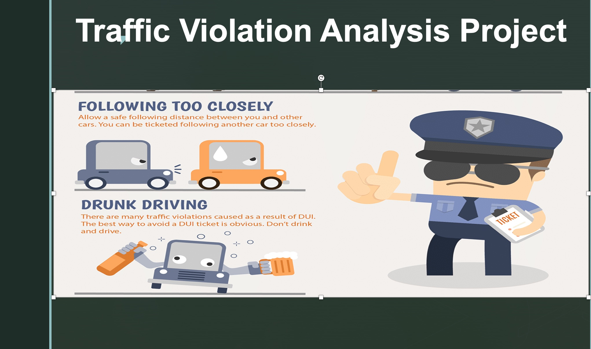

The project is about analyzing traffic violation

## Background

Data Description

Dataset obtained from data.com about the people who committed traffic violations from 2012 to 2016

Data contents 35 columns and 1,000,000 observations, however, only 10,000 observations and 25 columns have been extracted transformed loaded into Panda dataFrame for analysis and manipulation.

The 25 columns are: Belts, Personal, Injury, Property Damage, Fatal, Commercial License HAZMAT, Commercial Vehicle, Alcohol, Work Zone, State, Vehicle Type Year, Make, Model, Color, Violation Type, Charge, Article, Contributed to Accident, Race, Gender, Driver State, Drive City, DL State, Arrest Type.

## Goal:
The goal is to analyze the data to find insights that can help to reduce traffic and managed police enforcement resources

## Examples of insights:
#Q2: How many Female , Male who committed Traffic violation and what type it’s?

## Conclusion & Recommendation:

Data Set has 2750 Female and  6880 Male.

Most committed Traffic violation  was made by males but in percentage terms both males and females committed roughly the same level of violations.

Most Traffic violation committed by Black Race White Race come second with 10% differences between the two.

From the data we can establish that the police was not overly harsh as a 3rd of all stoppages let to only a warning being issued rather than a citation.

We see most violations on Thursday and Friday which might be an indication of work week fatigue kicking in.

Data regarding race shows that despite popular belief, the police were fair handed with handling violations by people form different race groups.

Roughly the same percentage of people got citations and warnings with no bias.

As expected most violation occur at night time when the roads are relatively empty make drivers careless and drive faster than they normally would
One of most interested facts is all violations committed no one has involved in an accident  !!!!

Data has four years 2012,13,14,15 and 2016 which was the year violation need more investigation specially all others share the same percentage

Moreover, November and December have most violation presumably because of the holiday session and extra vigilance around this time by the police to discourage drunk driving.
